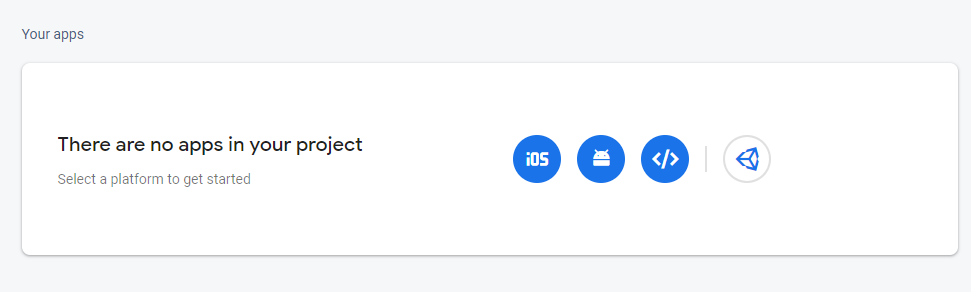

# StoryTime
**StoryTime** is a structured data management tool that for creating role-playing games. This tool will work with Unity3D &amp; Unreal engine 4


## Join Our Discord!
For help, support, discussion, and chill times, come and join the StoryTime community [Discord](https://discord.gg/SgJ8X5s)!

[Download the latest version here](https://github.com/vamidi/StoryTime/releases/)

### [Documentations](https://valencio-masaki16.gitbook.io/storytime/)

## Features
StoryTime allows users to edit data that are normally stored as raw JSON. It also supports creating stories or craftables in a node editor style.
Each table contains the data and metadata that defines the table. Users can also have access to versioning to see all the changes!
Everything is stored locally/online and easy to adapt in in-house environments.

## About / Why
It started as a school project where designers wanted to work with spreadsheets to create game data, but this became tedious, hard to manage, and hard to
collaborate in. So, I wanted to have an application that is able to edit data simular to spreadsheets, but also structured and indexable.
Aside from managing data, I also wanted to have plugins where I provide integration in Unity or Unreal where designers can immediately use their data in their games.
Lastly StoryTime also wants to provide easy building block for large complex components such as inventory, crafting or dialogues systems. 

## Requirements

* Make sure you have Node version >= 10.0 and (NPM >= 5 or Yarn ) [url](https://nodejs.org/en/download/)
* Your game engine of choice where you can receive JSON from the API.
* A Firebase database(free or blaze tier) or an SQL database (PostgreSQL, SQLite or MSSQL).
* A web host to communicate with Firebase and return JSON data to your framework/engine.

# Installation

## NPM Install

> **Ignore clone steps if you have downloaded the latest [release](https://github.com/vamidi/StoryTime/releases/) of StoryTime.**

```sh
# clone our repo
git clone https://github.com/vamidi/Project-StoryTime.git

# change directory to our repo
cd project-storytime

# install the repo with npm
npm install
```

## Firebase

* If you don't have a Google account create it. If you already have an account go to the [Firebase Console](https://console.firebase.google.com/u/0/).
* Login and follow the steps to create a new project.


* Fill in the name of your project. Once filled click to continue.


> These steps are optional, but I would recommend using it if you want to receive analytics for your app.

* Enable Google Analytics for this project if not already enabled and click continue.


* Select an account to use Google Analytics for, if this does not exist create one.
* Once finished click create project.


* Once your project is generated, press continue to go to the home screen.


* In the top left corner click on settings ⚙️ and click `project settings` to get your credentials.



* In the `General` tab when you scroll down you see that you do not have any apps in your project. Click on web app  and register your app.


* Fill in the name of your app, you can keep `Firebase Hosting` unchecked and click register app.

> **The config that you see will be for your firebase credentials. Keep them safe!**

* Once you have registered your app click to continue back to console, and you will see your credentials.

> **You can also use the credentials from the registration form**

## Authentication

> **For StoryTime to work you need users, so we have to add it now to the firebase project.**

* Go back to the firebase console, Under the `Build` category click on authentication.


* Click on `Get started` to continue to the authentication page.


* In the sign-in methods tab click on `email/password` and enable it (make sure to save it in order to see the changes).

* Go to the users tab


* Add a new user.
> **Can be any kind of email as long as it is a valid email. The password can be anything you want**

## Firebase database

> **For StoryTime to work you need to use Firebase realtime database, so we have to add it now to the firebase project.**

* Go back to the firebase console, unfold `build` on the left side panel and click realtime database.


* Click on `Create database` to continue setting up the database.


> **Choosing the database that is close to your location might help with the connection to the database**

* Choose the location where you want to store your database. You can choose what you prefer, I prefer United States.
* Click next to continue.


> **Database rules can be changed later!**

* For development purposes I recommend choosing test mode, this will give read write access until the timestamp is surpassed (30days).
* Click enable to continue.


* Once the database is created you are set and ready to configure StoryTime.

## Configuration

**StoryTime** uses environment variables to configure firebase automatice. The [.env] file contains all the environment variables used in **StoryTime**.
> **the `.env` should not be deleted or renamed, because the installation depends on this file.**

> **If you are using separate environments make sure you create multiple apps with different firebase credentials and different `.env.[YOUR_ENVIRONMENT]` files.**
* Create a file in the root of the project, name it `.env` and copy over the content from the `.env.example` file.

The following table describes the configurable environment variables.
> **Variables with an asterisk are optional**

| Variable                | Default Value                          | Description                                                       |
| ----------------------  | -------------------------------------- | ----------------------------------------------------------------- |
| APP_NAME*               | "StoryTime - Dev"                      | The name of your app                                              |
| FIREBASE_API_KEY        | YOUR_API_KEY                		   | The API key firebase uses to connect to the database.             |
| FIREBASE_AUTH_DOMAIN    | YOUR_AUTH_DOMAIN                       | Firebase auth domain.                                             |
| FIREBASE_DATABASE_URL   | YOUR_DATABASE_URL                      | Firebase database url to grab data from the database.             |
| FIREBASE_PROJECT_ID     | YOUR_PROJECT_ID                        | Firebase project id.                                              |
| FIREBASE_STORAGE_BUCKET | YOUR_STORAGE_BUCKET                    | Firebase storage bucket url.                                      |
| FIREBASE_MESSAGING_ID   | YOUR_MESSAGING_ID                      | Firebase messaging id.                                            |
| FIREBASE_APP_ID         | YOUR_APP_ID                            | Firebase app id.                                                  |
| FIREBASE_MEASUREMENT_ID | YOUR_MEASUREMENT_ID                    | Firebase measurement id.
| PRISMA_SECRET 	  	  | YOUR_RANDOM_PRISMA_SECRET		   	   | Random secure token that we check in order to make calls to the prisma API
| PATH_TO_CONFIG 	  	  | ./PATH/TO/YOUR/CONFIG.JSON.FILE		   | Path where the config.json file should be made.
| REL_PATH_TO_CONFIG 	  | ./REL_PATH/TO/YOUR/CONFIG.JSON.FILE		   | Relative path from the main.ts to the config.json file.

* Go back to Firebase console and in the top left corner click on settings ⚙️ and click afterwards on `project settings` to get part of the credentials needed.
* Scroll down and copy over apiKey, authDomain, projectId, storageBucket, messagingSenderId, appId and measurementId (optional), to the corresponding variables in the `.env` file

```js
var firebaseConfig = {
	apiKey: "[FIREBASE_API_KEY]",
	authDomain: "[FIREBASE_AUTH_DOMAIN]",
	projectId: "[FIREBASE_PROJECT_ID]",
	storageBucket: "[FIREBASE_STORAGE_BUCKET]",
	messagingSenderId: "[FIREBASE_MESSAGING_ID]",
	appId: "[FIREBASE_APP_ID]",
	measurementId: "[FIREBASE_MEASUREMENT_ID]"
};
```

* Go back to Firebase console and unfold `build` and click on realtime database.


* Copy the url and place in the `.env` file under the variable `FIREBASE_DATABASE_URL`.

## Development

* When all firebase variables are filled in, you are able to start the server to see everything in action.

```sh
# start the server
npm start

# if you're in China use cnpm
# https://github.com/cnpm/cnpm
```

go to http://localhost:4200 in your browser

## Production

> **Ignore build steps if you have downloaded the release of StoryTime.**

```sh
# Build for production
npm run build:prod
```

* Fill in the right credentials in `assets/data/config.json` to make API calls.
* Copy over dist, or the contents of the [release]() folder to your server where you want to run StoryTime from it from.
* Copy over the server folder to communicate with Firebase through Lumen (Laravel framework) - **WIP**.

## [Roadmap](https://open.codecks.io/storytime)
* Electron application.
* Support for SQL.
* Support for importing/exporting tables.
* Multiple column type support.
* Unreal engine 4/5 support.

## Games
* [KARI - STRANDED ON THE SHORES OF VANAHEIM](https://www.youtube.com/watch?v=NawQhWyXno0)

## License

The StoryTime is open-sourced software licensed under the [Apache 2.0](./LICENSE)

The Lumen framework is open-sourced software licensed under the [MIT license](https://opensource.org/licenses/MIT).

